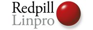
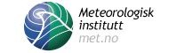
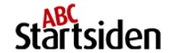
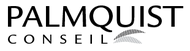

<h2>Nordic Perl Workshop 2009</h2>  

  <h4>Welcome to Oslo!</h4>
   
NPW2009 will be held in <b>Oslo, Norway on April 16th to 17th, 2009</b>. The conference topic is "Your future with Perl", with special focus on what's happening with Perl 6, Rakudo and Parrot, plus modern ways of using Perl 5.

   
This time we're co-locating NPW with <a href="http://goopen.no/index.php?sideID=76&ledd1=26">Go Open 2009</a>, a two-day conference about public sector use of Open Source software. 

   
After the conference we're hosting a <a href="http://www.perlfoundation.org/perl6/index.cgi?oslo_perl_6_hackaton_2009">Perl 6 and Enlightened Perl Hackathon</a> in cooperation with <a href="http://www.redpill-linpro.no/">Redpill Linpro</a>. Do you want to join some of the most interesting upcoming Open Source projects? This is your chance!

  <h4>About the conference</h4>
   <ul><li>Venue: <a href="http://www.folketeateret.com/?aid=9073663">Folketeateret</a>, Oslo</li>
     <li>Speakers include <strong>Larry Wall</strong>, Patrick Michaud, Jonathan Rockway and Matt Trout.</li>
     <li>Membership:
      <ul><li>Regular: 60 EUR</li>
          <li>Reduced (students): 40 EUR</li>
          <li>Support: 150 EUR</li>
          <li>NPW is a non-profit volunteer effort, so we also accept donations</li>
      </ul></li>
     <li>Registration: <a href="http://act.yapc.eu/npw2009/register">here</a></li>
     <li>See the <a href="http://act.yapc.eu/npw2009/wiki">wiki pages</a> for further info.</li>
   </ul>
  <h4>Related events</h4>
   <ul>
    <li><a href="http://www.perlfoundation.org/perl6/index.cgi?oslo_perl_6_hackaton_2009">Perl 6/Enlightened Perl Hackathon</a>, 18-20 april 2009.</li>
    <li><a href="http://szabgab.com/blog/2009/03/1235863222.html">Hands-on Perl 6 training</a> with Gabor Szabo, on april 18th 2009.  This event is limited to 12 people, and for sponsors and hackathon participants only.</li>
    <li><a href="http://act.yapc.eu/npw2009/news/360">Test automation training</a> with Gabor Szabo, 21-24 april 2009. The course has only room for 12 people.</li>
   </ul>

  <h4>Sponsors</h4>  

   
   
   
      
   
   
 

    <h2>Latest News </h2>  

 <h3 class="news-header">
  18 Apr 2009
  Conference is over!
 </h3>
 
 

We're done! The feedback has been positive and we had a very nice party to finish it all off on friday night. Thanks for everything! :)

 

  

 <h3 class="news-header">
  13 Apr 2009
  Meet-up on Wednesday before the conference
 </h3>
 
 
Everybody is invited to meet up on Wednesday before the conference. 
We'll meet at the Dubliner Pub in Rådhusgata 28 from 18:00: <a href="http://maps.google.no/maps?f=q&source=s_q&hl=no&geocode=&q=dubliner+oslo&sll=61.143235,9.09668&sspn=20.219494,67.675781&ie=UTF8&ei=HFfkSZrsHYek2AKmq-3bDg&sig2=4Xdby65eJWYYrPG2lMTA8A&cd=1&cid=59909904,10740760,12890284609415510924&li=lmd&z=15&iwloc=A">Google Maps</a>
 

  

 <h3 class="news-header">
  06 Apr 2009
  Most popular talks?
 </h3>
 
 

Wondering what others would like to attend at NPW? Now you can find out for yourself on the <a href="http://act.yapc.eu/npw2009/favtalks">Favorite Talks</a> page!

 

    

 <a href="/npw2009/news" class="news-link">Earlier announcements</a>

