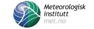
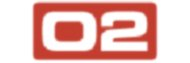
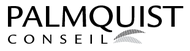

<h2>Nordic Perl Workshop 2009</h2>  

  <h4>Velkommen til Oslo!</h4>
   
NPW2009 vil bli avholdt i <b>Oslo, 16. og 17. april 2009</b>. Temaet for konferansen er "Din fremtid med Perl", med spesiell fokus p&aring; det interessante som skjer med Perl 6, Rakudo og Parrot, samt moderne metoder for &aring; ta i bruk Perl 5.

   
Denne gangen deler NPW lokaler med <a href="http://goopen.no/">Go Open 2009</a>, en to-dagers konferanse om bruk av fri programvare i offentlig sektor.

   
Etter konferansen arrangerer vi et <a href="http://www.perlfoundation.org/perl6/index.cgi?oslo_perl_6_hackaton_2009">Perl 6 og Enlightened Perl Hackathon</a> i samarbeid med <a href="http://www.redpill-linpro.no/">Redpill Linpro</a>. Har du lyst til &aring; bli med p&aring; noen av de mest spennede kommende Fri Programvare-prosjektene? Dette er din sjanse!

  <h4>Om konferansen</h4>
   <ul><li>Lokale: <a href="http://www.folketeateret.com/?aid=9072059">Folketeateret</a>, Oslo</li>
     <li>Foredragsholdere inkluderer <strong>Larry Wall</strong>, Patrick Michaud, Jonathan Rockway og Matt Trout.</li>
     <li>Medlemskap:
      <ul><li>Ordin&aelig;r: 60 EUR</li>
          <li>Redusert (student): 40 EUR</li>
          <li>St&oslash;tte: 150 EUR</li>
          <li>NPW er et nullprofitt dugnadsprosjekt, s&aring; vi godtar ogs&aring; donasjoner</li>
      </ul></li>
     <li>Registrering: <a href="http://act.yapc.eu/npw2009/register">her</a></li>
     <li>Se <a href="http://act.yapc.eu/npw2009/wiki">wiki sidene</a> for mer info.</li>
   </ul>
  <h4>Relaterte arrangement</h4>
   <ul>
    <li><a href="http://www.perlfoundation.org/perl6/index.cgi?oslo_perl_6_hackaton_2009">Perl 6/Enlightened Perl Hackathon</a>, 18-20. april 2009.</li>
    <li><a href="http://szabgab.com/blog/2009/03/1235863222.html">Hands-on Perl 6 training</a> med Gabor Szabo, 18. april 2009. Arrangementet er begrenset til 12 personer og er for sponsorer og hackathon deltagere.</li>
    <li><a href="http://act.yapc.eu/npw2009/news/360">Test automation training</a> med Gabor Szabo, 21-24. april 2009. Kurset har plass til kun 12 deltagere.</li>
   </ul>

  <h4>Sponsorer</h4>  

   
   
   
      
   
   
 

    <h2>Siste nytt </h2>  

 <h3 class="news-header">
  18 apr. 2009
  Konferansen er slutt!
 </h3>
 
 

Vi er ferdig! Tilbakemeldingene har vært positive og vi hadde en fin fest for å avslutte fredagskvelden. Takk for alt! :)

 

  

 <h3 class="news-header">
  13 apr. 2009
  Konferanse-forspiel på onsdag før konferansen
 </h3>
 
 
Alle er invitert til å møtes på onsdagen fra kl. 18:00. 
Vi møtes på Dubliner i Rådhusgata 28: <a href="http://maps.google.no/maps?f=q&source=s_q&hl=no&geocode=&q=dubliner+oslo&sll=61.143235,9.09668&sspn=20.219494,67.675781&ie=UTF8&ei=HFfkSZrsHYek2AKmq-3bDg&sig2=4Xdby65eJWYYrPG2lMTA8A&cd=1&cid=59909904,10740760,12890284609415510924&li=lmd&z=15&iwloc=A">Google Maps</a>
 

  

 <h3 class="news-header">
  06 apr. 2009
  Mest populære foredrag?
 </h3>
 
 

Hva vil folk se på NPW? Finn ut for deg selv på vår nye <a href="http://act.yapc.eu/npw2009/favtalks">Favoritt-foredrag</a> side!

 

    

 <a href="/npw2009/news" class="news-link">Tidligere annonseringer</a>

